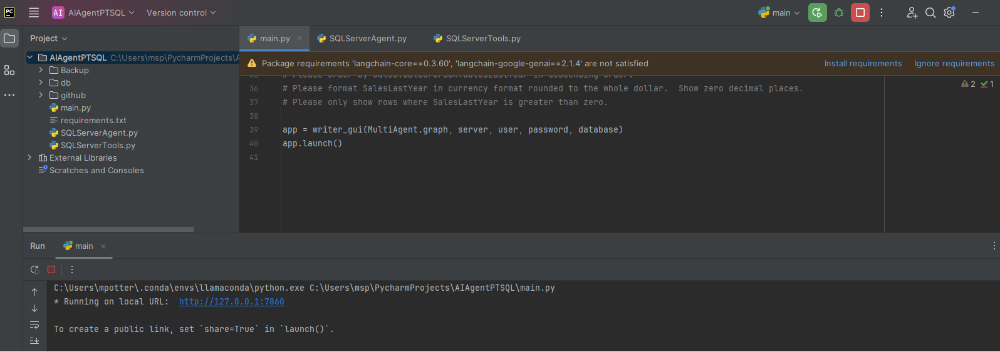
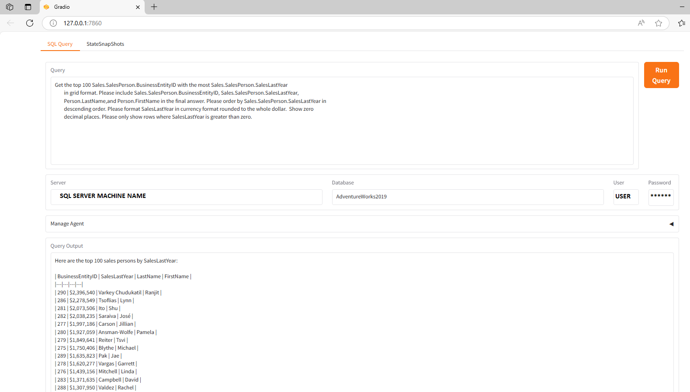

# AIAgentPTSQL

AI Agent to query a MS SQL Database using natural language.

This project was created from the following examples.
	- https://github.com/langchain-ai/langgraph/blob/main/docs/docs/tutorials/sql-agent.ipynb
	- https://learn.deeplearning.ai/courses/ai-agents-in-langgraph/lesson/m0x4m/essay-writer

The primary purpose was to use a real DB backend like MSSQL SERVER 2019.
This enables the agent to run locally on a dev box.

# Purpose

To communicate with the database using natural language instead of strict SQL queries.

# Features

MS SQL SERVER 2019 BACKEND
MS SAMPLE DB AdventureWorks
Gradio UI component to control the agent
By just changing the connection string different databases may be queried.
Uses gemini-2.0-flash LLM from Google

# Installation

Install SQL Server 2019 locally.
Restore data\AdventureWorks2019.bak
Create PYCharm AIAgentPTSQL project locally in a chosen virtual environment
Add dependencies to virtual environment as described in requirements.txt
Add in src files main.py, SQLServerAgent.py, SQLServerTools.py
Modify main.py to reference your DB server with the appropriate info
	- server = "add DB server name for MSSQL 2019"
	- user = "add DB user for MSSQL AdventureWorks"
	- password = "add DB user password for MSSQL AdventureWorks"
	- database = "add DB name for MSSQL AdventureWorks restore of AdventureWorks2019.bak"
Please note **this python code will create a stored procedure in the DB please make sure the
	    **the DB SQL user has the authority to do this
Modify SQLServerAgent.py to update your GOOGLE API key.

# Usage

Run main.py from PYCharm project

System will create a local URL "* Running on local URL:  http://127.0.0.1:7860"
Click on link to instance the Gradio UI in your default browser
Click Run Query button to run the agent for DB AdventureWorks2019 with the default query

